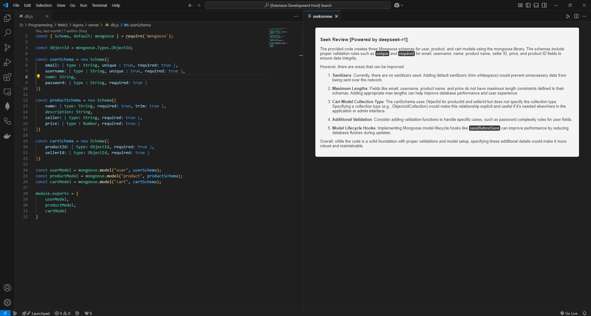
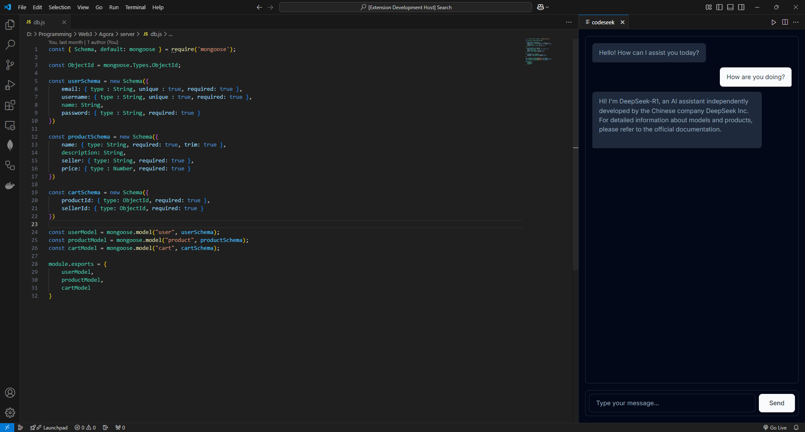

# codeseek

Your personal AI code reviewer and chatbot powered by deepseek-r1.
*You will need ollama installed for utilizing this extension,
also the response time would vary depending on your hardware.*

**To use codeseek -**
* First Ensure the extension is installed.
* Then use command `ctrl + shift + p` to open the command palette.
* Use command `CodeSeek` to open the chatbot.
* Use command `SeekReview` to run code reviewer.

## Features

* CodeSeek : Deepseek-r1:7b powered chatbot  helping you out with your queries on the go!
* SeekReview: Giving you code review of current active window and improvements to it (if any).

*SeekReview*

*CodeSeek*

> Tip: If the response if very slow, you can just clone the repo and change the model according to your required params.

## Requirements

You will need ollama up and running locally and also `deepseek-r1:7b` model installed.

*if not, then follow the below steps:*
* Download Ollama from [here](https://ollama.com/) and install it.
* Now that it's installed, run your terminal and type the command, `ollama run deepseek-r1:7b` this will pull the llm model onto your machine for first time run.
* You can now use the extension!

## Known Issues

As it's my first extension, there mmight be some issue, feel free to open them on the official repo and even contribute with any features you think might be needed in it.

## Release Notes

### 1.0.0

Initial release of codeseek
